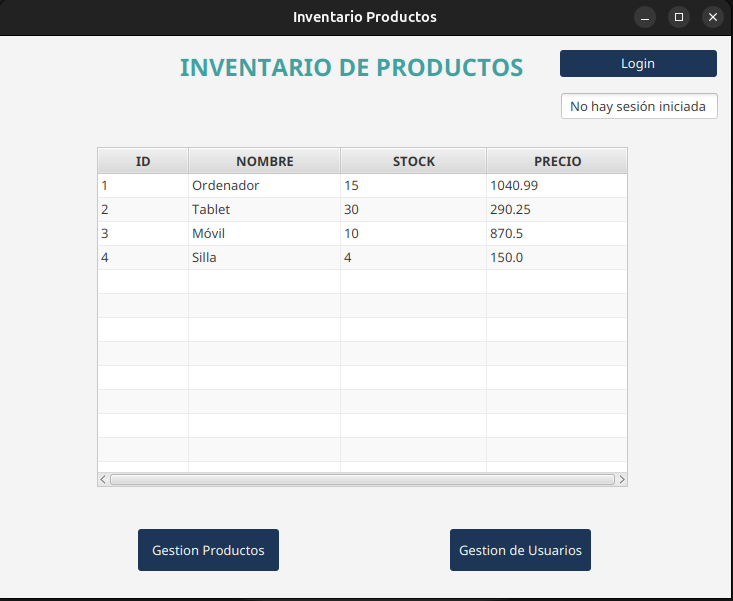
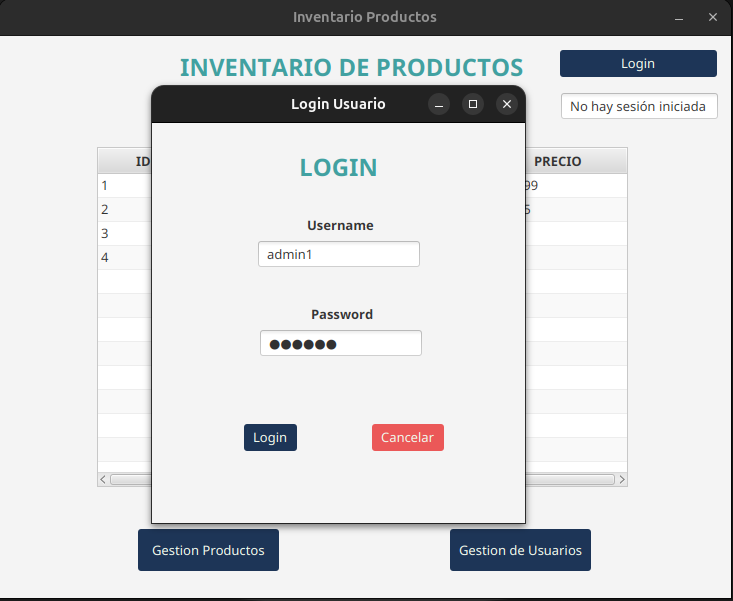
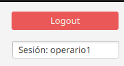
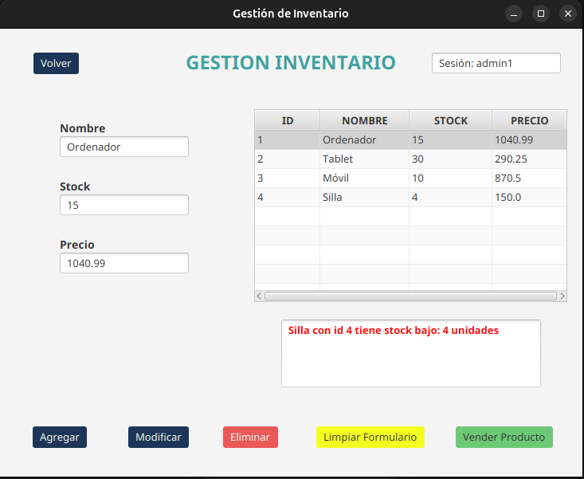
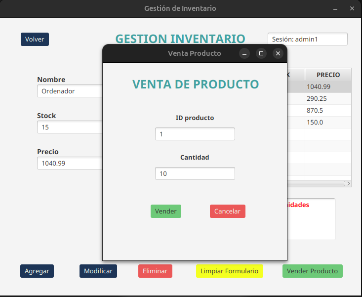

#  📦 Gestor de inventario

Aplicación de escritorio para la **gestión de inventario** desarrollada con **JavaFX** y **Spring Boot**.  
Permite administrar productos, realizar ventas y controlar el acceso mediante usuarios con diferentes **roles**.

---

## 📑 Características principales

- Gestión de productos: agregar, modificar, eliminar y vender producto.
- Control de stock con alerta de productos con stock bajo.
- Ventana para ventas con actualización automática de inventario.
- Gestión de usuarios con roles y permisos:
    - **ADMIN:** Acceso completo a gestión de productos y usuarios.
    - **OPERARIO:** Acceso solo a gestión de productos.
    - **CLIENTE:** Solo consulta de inventario.
- Sistema de login y logout con sesión de usuario.
- Interfaz gráfica moderna con JavaFx.
- Integración con base de datos mediante Spring Boot y Hibernate.

--- 

##  🛠️ Tecnologías usuadas

- **Java 21**
- **JavaFX**
- **Spring Boot**
- **Spring Data JPA / Hibernate**
- **MySQL**
- **Maven** para gestión de dependencias
- **Lombok** para reducir el código repetitivo (getters, setters, contructores) para las entidades

---

## 📂 Estructura del proyecto

```` 
gestor_inventario/
├─ src/main/java/com/gestor_inventario/
│ ├─ controlador/                           -> Controladores para vistas JavaFX
│ ├─ modelo/                                -> Entidades JPA
│ ├─ presentacion/                          -> Clase intermediaria entre la lógica de Spring Boot y la interfaz de JavaFX.
│ ├─ repositorio/                           -> Repositorios Spring Data JPA
│ ├─ servicio/                              -> Lógica de negocio
│ └─ sesion/                                -> Gestión de sesión de usuario
│ └─ GestorInventarioApplication            -> Clase donde se configura Spring Boot e inicia el proyecto (se llama a presentacion/GestorInventarioFx)
├─ src/main/resources/
│ ├─ templates/                             -> Archivos FXML
│ └─ application.properties                 -> Configuración general del proyecto
├─ pom.xml                                  -> Configuración de Maven
````

---

## 🚀 Cómo ejecutar

1. Clona el repositorio:

```bash
  git clone https://github.com/JaimeBonBol/Gestor-Inventario.git
```

2. Abre el proyecto en el IDE que prefieras.
3. Configura la base de datos y tus credenciales en `application.properties`
4. Ejecuta la clase `GestorInventarioApplication`

---

## ✨ Vista del proyecto

### Pantalla principal


**Cuando iniciamos la aplicación aparece el inventario con los productos disponibles**

---

### Ventana Login


**Para iniciar sesión, aprece una ventana emergente donde a través de el username y la contraseña se inicia sesión**

---

### Logout


**En todo momento aparece la sesión con el username del usuario, y la opción de logout para así poder iniciar sesión con 
cualquier otro usuario**

---

### Gestor de productos


**Ventana para la gestión de productos, a la cuál pueden acceder los ***Administradores*** y los ***Operadores***, en ella
pueden agregar producto, modificar producto, eliminar producto y vender producto. También cuenta con un panel de alerta
en el que se muestran los productos con stock bajo (menor de 5 unidades)**

---

### Ventana venta de producto


**Ventana emergente para la venta de un producto, en ella se debe seleccionar el id del producto y la cantidad deseada de
venta, en caso de que el producto exista y haya suficiente stock, se realiza la venta**

---

### Gestión de usuarios


**Ventana para la getsión de usuarios, a la cuál pueden acceder tan solo los ***Administradores***, en ella se pueden
realizar acciones como agregar usuario, modificar usuario, eliminar usuario**


---

## 🙋‍♂️ Sobre este proyecto

Este proyecto ha sido una de mis primeras experiencias con la tecnología JavaFX, y la verdad que esta tecnología me ha
sorprendido gratamente ya que permite realizar aplicaciones de escritorio de una forma cómoda y eficiente.

Aún faltan muchas mejoras como la **encriptación de contraseñas**.

### 💬 ¿Tienes sugerencias o mejoras?

Estoy totalmente abierto a:

- Consejos sobre buenas prácticas o mejoras de diseño.
- Ideas para extender la funcionalidad.
- Feedback en general sobre la estructura del código, organización del proyecto o estilo de documentación.

Puedes contactarme si tienes alguna recomendación.  
¡Toda sugerencia es bienvenida y valiosa para seguir aprendiendo!
